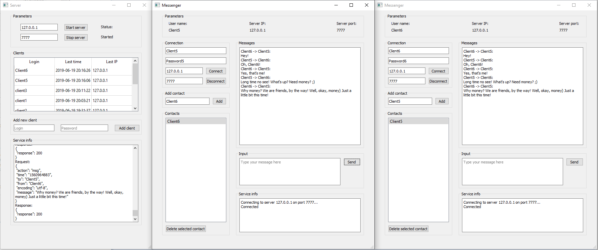

# Messenger
Проект представяет собой учебный чат-мессенджер на Python. 
Состоит из клиентской и серверной частей. 
Сетевое взаимодействие осуществляется с использованием сокетов.
Сервер использует библиотеку select для работы с несколькими клиентами сразу.
Для обмена сообщениями используется протокол JIM.
Клиент и сервер имеют как консольную, так и графическую версии. Последняя предпочтительнее по удобству и полноте поддерживаемого функционала.
Графический интерфейс пользователя реализован с использованием PyQT5.
В качестве базы данных используется sqlite, при этом ORM не применяется.
Реализован механизм авторизации пользователей с использованием модулей hmac и hashlib.

## Сервер
Рассмотрим графическую версию сервера. 

### Parameters
В данном блоке можно задать хост и порт для сервера, а также запустить или остановить его. Если сервер запущен, в поле `Status` появится значение `Started`.

### Clients
Таблица содержит историю активности клиентов: логин, дата и время последнего посещения, IP-адрес, с которого в последний раз заходил пользователь. Данные отсортированы по времени (более новые вверху).

### Add new client
Чтобы клиент мог пользоваться чатом, его нужно сначала зарегистрировать на сервере. Для этого в данном блоке нужно ввести его логин и пароль, затем нажать кнопку `Add client`.

### Service info
В данное поле выводится вся информация о работе сервера: служебные данные, сообщения об ошибках, а также все сообщения, которые принимает и отправляет сервер, плюс информация о подключениях и отключениях клиентов.

## Клиент
Рассмотрим графическую версию клиента.

### Connection
Для начала работы нужно ввести данные для соединения с сервером:

 - `User name` - логин
 - `Password` - пароль
 - `Server IP` - адрес или имя хоста сервера
 - `Server port` - номер порта, на котором работает сервер

Кнопка `Connect` позволяет выполнить подключение к серверу, кнопка `Disconnect` - отключение.

### Parameters
Когда клиент успешно подключился к серверу, в данном блоке отображается информация о подключении: логин пользователя, адрес хоста и номер порта сервера.

### Контакты
В блоке `Contacts` отображается список контактов пользователя. Чтобы добавить новый контакт, нужно ввести логин в поле `Add contact` и нажать кнопку `Add`. После этого можно писать данному пользователю сообщения. Если клиенту приходит сообщение от контакта, которого ещё нет в списке, то он автоматически там появляется.
Для удаления контакта нужно выбрать его из списка и нажать кнопку `Delete selected contact`.

### Сообщения
Для отправки сообщения контакту нужно выбрать его в списке щелчком левой кнопки мыши. После этого в поле `Messages` появится история переписки с данным пользователем (если она была ранее). Чтобы послать ему новое сообщение, требуется ввести текст в поле `Input` и нажать кнопку `Send`. Для успешной доставки сообщения необходимо, чтобы получатель также был подключен к серверу. В противном случае сервер ответит ошибкой с текстом "client not online".
Входящие сообщения будут отображаться в `Messages` по их получения клиентом.

### Service info
В данном блоке выводится информация о работе клиента, это служебные данные и сообщения об ошибках.